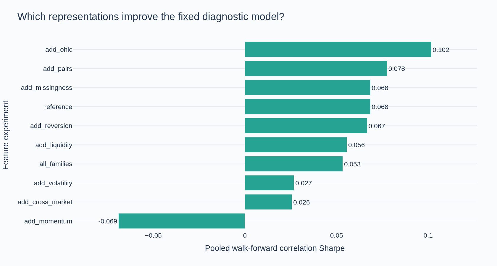

# Commodity Prediction

Multi-horizon commodity return forecasting with point-in-time features, purged walk-forward validation, interpretable Plotly notebooks, and reproducible AWS experiments.

**Current phase: initial feature research. Feature gate: open.** The project uses the MITSUI&CO. Commodity Prediction Challenge as an offline forecasting research problem. Final models and reserved-holdout evaluation remain future work. Kaggle submissions are outside the project scope.

## Start with the notebooks

| Notebook | Question answered |
| --- | --- |
| [00 · Data audit](notebooks/00_data_audit.ipynb) | What is predicted, when are labels available, and which dates are reserved? |
| [01 · Exploratory analysis](notebooks/01_eda.ipynb) | How do market coverage, missingness, and target availability shape the features? |
| [02 · Feature research](notebooks/02_feature_research.ipynb) | Which feature families help a fixed diagnostic model, and how stable are the gains? |

All three notebooks execute in fresh kernels on AWS. Nine Plotly figures include static GitHub previews, and every result is linked to verified source, configuration, and data fingerprints. See the [AWS execution record](reports/aws_execution.json).

## First controlled experiment

- **1,961 dates · 557 input columns · 424 targets · four horizons.**
- **9,418 candidates** across nine domain-motivated feature families.
- **30 fold/representation experiments**, covering all 424 targets, with a fixed Ridge diagnostic model.
- Training-only screening is capped at **96 features**. The final combined-family fold rejects **9,322** candidates, mostly because of that diagnostic budget; this does not prove those features lack signal.
- Three expanding 180-date validation blocks with five purged dates per block. The final **252 dates remain reserved**.

| Representation | Pooled official metric | Change vs. reference |
| --- | ---: | ---: |
| Return reference + OHLC | **0.101686** | **+0.033230** |
| Return reference + pair features | 0.077561 | +0.009104 |
| One-date-return reference | 0.068456 | — |
| All candidate families | 0.053393 | −0.015064 |

The OHLC improvement's conditional paired 95% interval is **[−0.0659, +0.1294]**. It is an initial lead, not an established improvement. Momentum performed worse in this shared-screen/linear-model experiment. Missingness candidates did not displace the reference features. Wider feature coverage alone did not improve the model.



The official metric is **mean daily cross-sectional Spearman correlation / population standard deviation**. It is not a realized trading Sharpe ratio, and these historical scores are not leaderboard results. See the [research protocol](docs/research-protocol.md) and [full results](reports/research.json).

## Methodological safeguards

Targets start at t+1 and end at t+h+1; releases occur h+1 dates after prediction. Five dates are purged before each validation interval. Features use current or earlier observed market data, with no backward filling or centered windows. Feature selection, imputation, normalization, and redundancy screening use only each fold's training interval. Missing targets never become fitting labels.

All **31 automated tests** pass. They cover time ordering, release timing, metric parity, future-data mutation invariance, training-only screening, replayable coefficients, checkpoint tampering, atomic writes, and heartbeat logs. An identical second run reused all 31 completed feature/fit checkpoints and finished in approximately 1.7 seconds. Ruff, formatting, type checks, and publication verification are required CI gates.

## Reproduce

Python 3.12 and `uv.lock` define the environment. Obtain the [competition data](https://www.kaggle.com/competitions/mitsui-commodity-prediction-challenge/data) through your own authorized access and extract it to `data/raw/`.

```bash
uv sync --frozen --extra dev
uv run --frozen --extra dev python scripts/quality.py
uv run --frozen commodity research
uv run --frozen python -m ipykernel install --user --name commodity
uv run --frozen kaleido_get_chrome
uv run --frozen python scripts/execute_notebooks.py
```

Use a Linux/Jupyter environment that permits local kernel communication and Chrome rendering. Raw data, model predictions, and fitted artifacts are excluded from Git.

## AWS research environment

Private SageMaker JupyterLab space **`commodity-prediction-dev`**, in **`us-west-2`**, with **`ml.m5.xlarge` (4 vCPU, 16 GiB RAM)**, **50 GB persistent EBS**, and a **60-minute idle timeout**. CPU compute is **$0.23 per active hour**, verified against AWS Pricing on 2026-09-09; storage and transfer are additional.

An encrypted, versioned private S3 bucket stores source data and stage checkpoints. Settings are in [configs/aws.json](configs/aws.json). Startup restores a checksum-pinned snapshot, validates every manifest, reuses completed fits, and verifies the notebooks before publishing cloud completion evidence.

## Next research gate

Prioritize target/pair-specific screening and structural return forecasts, conditional group ablations, and nonlinear controls. Then assess regime stability, feature interactions, release-aware pooling, external point-in-time data, and selection uncertainty. Final optimization begins only after the evidence supports diminishing returns from major plausible feature families.

## Data and sources

Competition data is **Competition Use Only** and is not redistributed here. Source and aggregate evidence are separated from private market rows, labels, and predictions. Other deployment or commercial use requires appropriate data rights.

[Dataset](https://www.kaggle.com/competitions/mitsui-commodity-prediction-challenge/data) · [Official metric](https://www.kaggle.com/code/metric/mitsui-co-commodity-prediction-metric) · [Target calculation](https://www.kaggle.com/code/sohier/mitsui-target-calculation-example/) · [Rules](https://www.kaggle.com/competitions/mitsui-commodity-prediction-challenge/rules)
