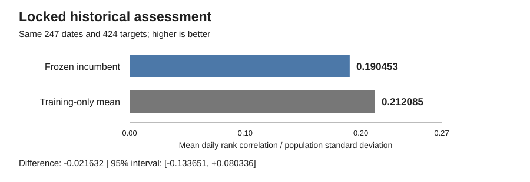

# Commodity Forecasting | ML Engineering Case Study

**Alvaro Mendizabal** · [GitHub profile](https://github.com/alvaromendizabal)

End-to-end research on return ranking across **424 commodity-related targets and four forecast horizons**. The work combines point-in-time data engineering, domain-informed representations, controlled model comparisons, restartable AWS execution, independent reconstruction of selected public solution ideas, and a locked historical assessment.

**Portfolio status: published and employer-facing. Research status: private frontier work resumed.** The completed historical assessment remains frozen; new research is evaluated separately and does not rewrite that result.

**Start here:** [Portfolio notebook](notebooks/27_portfolio_case_study.ipynb) · [Technical case study](docs/PORTFOLIO_CASE_STUDY.md) · [Current frontier update](docs/FRONTIER_RESEARCH_UPDATE.md) · [Verified aggregate results](reports/portfolio_summary.json)

## Engineering highlights

| Area | What I built and evaluated |
|---|---|
| Information timing | Data contracts, horizon-aware label availability, chronological partitions, and a reserved assessment boundary |
| Modeling and validation | Domain-informed pooled nonlinear models plus independently reconstructed public-solution-inspired model families, compared on matched dates and targets |
| Research diagnosis | A zero-fit saved-prediction reconciliation that isolated why an apparent model expansion lost its screening gain |
| Reliable execution | Restartable checkpoints, artifact hashes, exact prediction replay, managed SageMaker training, and safe recovery from interrupted or failed jobs |
| GPU orchestration | Managed GPU training with deterministic job identity, quota-aware instance routing, checkpoint reuse, and failure classification before retry |
| Analytical communication | Notebook-based comparisons that distinguish exploratory gains, temporal replication, uncertainty, negative results, and promotion decisions |

The [case study](docs/PORTFOLIO_CASE_STUDY.md) follows the most informative completed investigation. The [frontier update](docs/FRONTIER_RESEARCH_UPDATE.md) summarizes the newer private research program without publishing the latest implementation or exact training recipe.

## Verified results

Each comparison below uses the same dates and targets for its two systems. Different rows use different populations and are not directly comparable.

| Evaluation population | Result | Decision |
|---|---|---|
| Development reference: 535 dates, 424 targets | Established `current_market` system: **0.309709** | Historical development reference |
| Later-period replication: 355 dates, 424 targets | Incumbent **0.276025**; frozen panel **0.289365**; difference **+0.013340** | Conditional 95% interval **[-0.009061, +0.035750]**; panel not promoted |
| Locked historical assessment: 247 dates, 424 targets | Frozen incumbent **0.190453**; training-only mean **0.212085**; difference **-0.021632** | Conditional 95% interval **[-0.133651, +0.080336]**; no demonstrated advantage over the control |
| Later-period neural reconstruction: 355 dates, 424 targets | Direct neural combination **0.105102**; three-way blend **0.287436** vs frozen panel **0.289365** | Neural family rejected; blend did not improve the retained panel |

The metric is mean daily cross-sectional rank correlation divided by its population standard deviation, without annualization. These are **local historical evaluation scores, not official Kaggle leaderboard results or trading returns**. No competition win or production deployment is claimed.

## Frontier research

After the original closeout, I reopened the project privately to test materially different model families rather than continue small variations of the same baseline.

The current research program has:

- independently reconstructed and evaluated a target-routed tree/stack family inspired by a top public solution;
- rejected a recursive sequence-forecast formulation after a negative controlled test;
- completed a direct MLP/RNN reconstruction with separate loss ablations and two-seed evaluation, then rejected it because it did not improve the retained panel;
- prepared a feature-token Transformer experiment with point-in-time released-target features, managed GPU execution, deterministic SageMaker job reconciliation, and resumable checkpoints;
- preserved the original historical assessment as a fixed record rather than retuning against it.

The Transformer frontier is **engineering-ready but has no scientific score yet** in this public update. Infrastructure failures before the first fit are not counted as model results.

See [Frontier Research Update](docs/FRONTIER_RESEARCH_UPDATE.md) for the public, non-reproducible summary.

## Review the portfolio

The [portfolio notebook](notebooks/27_portfolio_case_study.ipynb) is a read-only presentation export with inline Plotly evidence and static SVG fallbacks. It presents the problem, engineering decisions, comparisons, and conclusions without distributing the latest executable training system.

The **market-path** study supplies the 0.309709 development reference. Earlier source, notebooks, and configuration files remain historical records; their original “research open,” “final set reserved,” or “project closed” statements describe prior stages, not the current frontier status.

## Public portfolio, private research

This repository is an employer-facing presentation, **not a release of the latest training system or a replication kit**. The newest complete implementation, exact training configurations, model weights, private prediction matrices, GPU checkpoint state, environments, credentials, and AWS operational records remain private.

Earlier public source and history remain public; this update does not change repository visibility, rewrite history, or replace existing licenses and attribution. Public solution ideas are attributed and independently reimplemented where tested; complete reproduction of undisclosed winning systems is not claimed.

The objective of the private frontier work is measurable improvement, not publishing a copy of someone else’s solution. Promotion requires matched-population evidence and survives later-period checks before it can replace a retained model.
