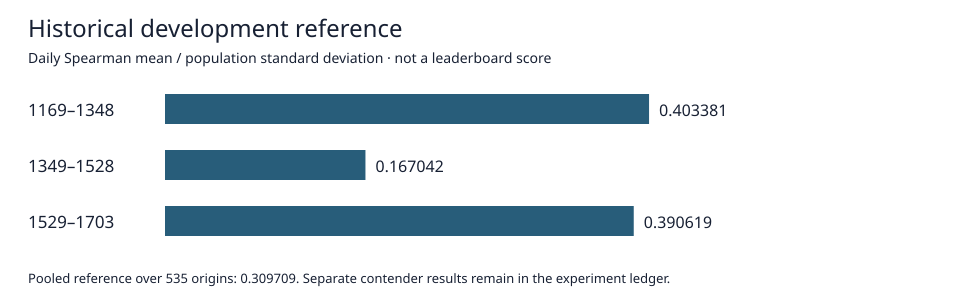

# Commodity Prediction Research

A reproducible, feature-first investigation of short-horizon, multi-asset return ranking.

**Start here:** [research overview notebook](notebooks/portfolio_overview.ipynb) ·
[experiment ledger](docs/MANUAL_RESEARCH_RESULTS.md) ·
[reproduction guide](docs/MANUAL_REPRODUCTION.md) ·
[aggregate evidence](reports/manual_research/index.json)

## Research question

Which representations of market observations and legally released target history improve
short-horizon cross-sectional forecasts, and do those improvements transfer across time?
The project studies target/pair structure, market behavior, released priors, temporal
representations and controlled feature-family additions/removals. Negative findings are
retained rather than hidden.

## Evaluation boundary

The established `current_market` reference scores **0.309709 over 535 development origins**.
Its three period scores are **0.403381**, **0.167042**, and **0.390619**, respectively.
This is a historical local development reference, **not a Kaggle leaderboard score or a
claim that no later contender has a higher point estimate**. Consult the period-specific
ledger below for newer comparisons. Do not rank runs evaluated on different dates together.

The metric is the mean daily cross-sectional Spearman correlation divided by its population
standard deviation, without annualization. Feature values follow prediction-time availability;
label-derived features respect horizon-specific release delays. The final evaluation remains
separate from repeated exploratory development. A positive point estimate is not automatic
model promotion or proof of a competition record.

GitHub displays notebooks statically; use JupyterLab or a compatible notebook
viewer for interactive Plotly controls. The SVG preview above needs no JavaScript.

## What is public

This repository includes research implementation, tests, declared configurations, and
notebooks with inline Plotly output when execution evidence exists. Raw/derived dataset
files, fitted weights, credentials, environments and infrastructure logs are not distributed
here. There is **one public repository**: no separate private code repository is required.
Existing license and third-party notices are preserved.

## Experiment index

| Notebook | Investigation | Evidence status | Origins |
|---|---|---|---:|
| 03 | Runtime and feature readiness | NOTEBOOK_AND_FEATURE_AUDIT_READY | 0 |
| 04 | Normalization first-period screen | NOTEBOOK_AND_FIRST_FOLD_REVIEW_READY | 180 |
| 05 | Normalization temporal validation | NOTEBOOK_AND_VALIDATION_REVIEW_READY | 535 |
| 06 | Session candidate laboratory | NOTEBOOK_AND_SESSION_FEATURES_READY | 0 |
| 07 | Session feature ablations | NOTEBOOK_AND_SESSION_ABLATION_READY | 180 |
| 08 | Cross-asset peer features | NOTEBOOK_AND_CLOSE_NETWORK_READY | 180 |
| 09 | Network removal and rank laboratory | NOTEBOOK_AND_DIAGNOSIS_READY | 180 |
| 10 | Released historical-rank states | NOTEBOOK_AND_RANK_STATE_READY | 180 |
| 11 | Instrument context | NOTEBOOK_AND_TARGET_CONTEXT_READY | 180 |
| 12 | Delayed response encoding | NOTEBOOK_AND_RESPONSE_READY | 180 |
| 13 | Saved-model information audit | NOTEBOOK_AND_INFORMATION_AUDIT_READY | 535 |
| 14 | Ordinary and robust innovations | NOTEBOOK_AND_FEATURE_ROUND_READY | 180 |
| 15 | Prior dynamics screening | NOTEBOOK_AND_FEATURE_ROUND_READY | 180 |
| 16 | Prior dynamics temporal replication | NOTEBOOK_COMPLETE | 535 |
| 17 | Observed-event histories | NOTEBOOK_COMPLETE | 180 |
| 18 | Released sequence structure | NOTEBOOK_COMPLETE | 175 |
| 19 | As-of prior-error memory | NOTEBOOK_COMPLETE | 175 |

`REPORT_NOT_AVAILABLE` means no matching report was available in the active workspace at
export time; it does not mean the experiment did not occur. Pending or failed work is never
listed as a completed score. Export reads saved evidence without fitting models or executing
research notebooks. See [disclosure notes](docs/PUBLICATION_SCOPE.md).

## Engineering and reproducibility

Experiments use bounded workers, training-partition preprocessing, explicit stage manifests,
checkpoint checksums, saved-prediction replay and per-study fit/time accounting. These are
reported safeguards, not a substitute for independent reproduction. Prepared tests are not
called passing tests without their execution receipts. Inline figures remain in notebooks;
self-contained HTML is supplemental. Reproduction is manual and requires licensed data.

Earlier source, methodological notes and historical publication evidence remain in this
repository. The original README is retained under `docs/history/` when this update is first
prepared. No Git history rewrite, repository rename or visibility change is part of this release.

**Current phase: feature research remains open.** The goal is the strongest valid comparable
performance, not an unsupported leaderboard claim.

<!-- manual-publication:market-path-reference -->
## Development reference

The strongest pooled development reference preserved by the **market-path** study is **0.309709** on the official development metric across 535 validation dates. This is a local development result—not a final-test or Kaggle leaderboard score. See [`docs/market-path-research.md`](docs/market-path-research.md) for the bounded study and [`docs/MANUAL_RESEARCH_RESULTS.md`](docs/MANUAL_RESEARCH_RESULTS.md) for the later manual feature ledger.
