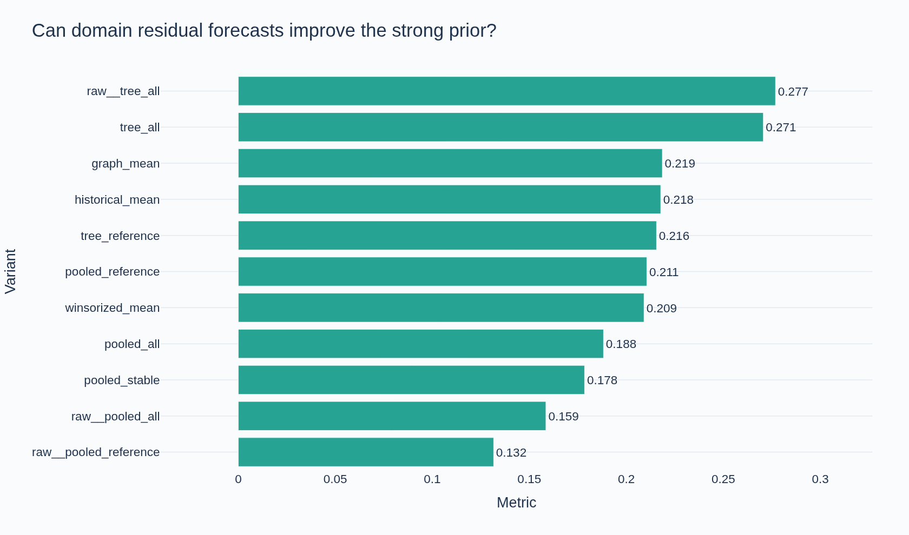
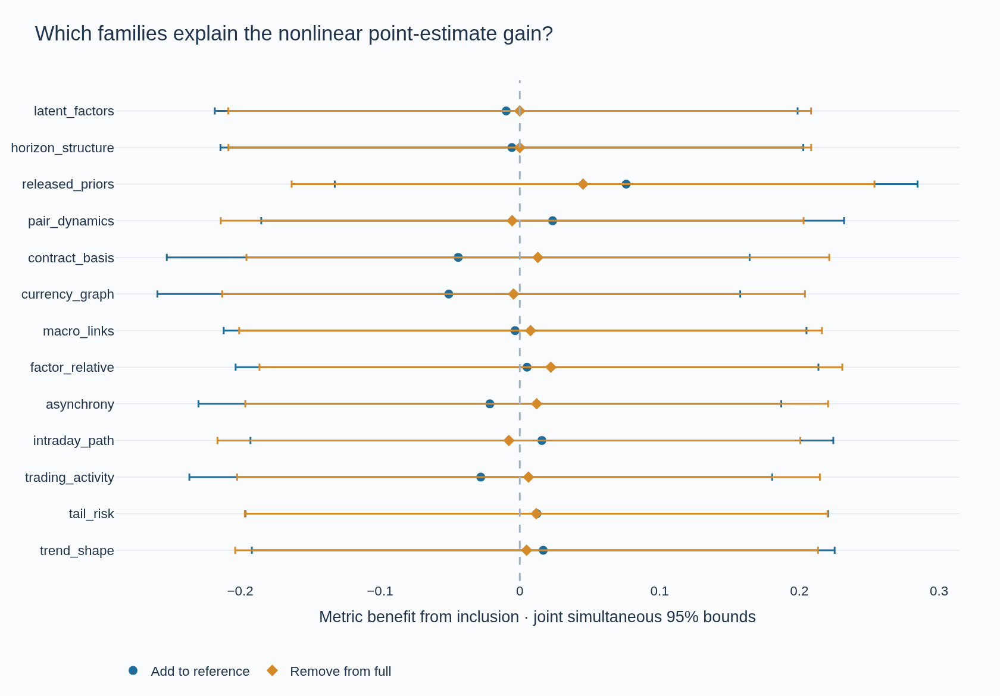

# Commodity Prediction

Domain-driven feature engineering for multi-horizon commodity return prediction, with point-in-time market features, purged temporal validation, interpretable notebooks, and reproducible AWS experiments.

**Current phase: domain feature research. Feature gate: open.** The project studies 424 return targets across LME, JPX, US equities, and FX. A nonlinear domain model improves the development point estimate, but uncertainty and uneven temporal gains do not justify final-model promotion. Final optimization and the one-time final test remain gated.

## Start with the notebooks

| Notebook | Question answered |
| --- | --- |
| [00 · Data audit](notebooks/00_data_audit.ipynb) | What is predicted, when is information available, and which dates are reserved? |
| [01 · Exploratory analysis](notebooks/01_eda.ipynb) | How do availability, risk scales, and market relationships shape the features? |
| [02 · Feature research](notebooks/02_feature_research.ipynb) | Which domain families help under matched tests, and what survives uncertainty? |

The three canonical notebooks execute in fresh AWS kernels. **22 Plotly figures** include static GitHub previews. The [domain ledger](docs/domain-feature-research.md) connects each hypothesis to its implementation, primary sources, timing assumptions, and limitations.

## Extensive features with controlled attribution

The domain representation contains **380 pooled input templates** across a reference and **13 domain families**: trend shape, tail risk, trading activity, intraday paths, asynchronous observations, factor-relative returns, macro-market links, FX currency structure, contract/settlement differences, pair dynamics, released historical priors, horizon structure, and trailing latent factors.

These instantiate **29,917 intermediate source series** and **161,120 target-template assignments**. These counting units are distinct: some transformations revisit earlier hypotheses, shared contexts repeat across targets, and not every instrument supports every feature. They are not claims of independent signals.

For paired targets, asset features are represented through left-minus-right and left-plus-right quantities. A shared model forecasts risk-normalized residuals above each target's training mean. Every imputer, scaler, supervised screen, target normalization, and estimator is fitted within its training interval. Labels used as features are delayed by exactly horizon + 1.

The controlled design completed:

- **279 fitted models**: 31 variants across three outer folds and two inner folds per outer fold. The inner folds choose residual strength without using outer validation labels.
- **Nine outer control evaluations**: historical, graph-projected, and winsorized target means.
- **78 additional tree fits**: 13 family additions and 13 removals across the same outer folds, with fixed model settings and residual weight one.
- Paired block uncertainty, matched additions/removals, frozen-model family permutation, horizon diagnostics, temporal blocks, and selection stability. All **99 earlier fold experiments** remain preserved.

## Results on the same 535 validation dates

| Representation | Official metric | Fold 1 | Fold 2 | Fold 3 |
| --- | ---: | ---: | ---: | ---: |
| Historical target means | 0.217739 | 0.162550 | 0.182488 | 0.296861 |
| Full domain pooled Ridge | 0.188233 | 0.299098 | -0.031277 | 0.308060 |
| Full domain tree, nested calibration | 0.270612 | 0.348697 | 0.111470 | 0.377329 |
| Full domain tree, unshrunk | 0.276887 | 0.348697 | 0.111470 | 0.402333 |
| Tree reference + released priors, unshrunk | 0.281237 | 0.337566 | 0.158447 | 0.352253 |
| Tree without intraday features, unshrunk | 0.284713 | 0.298038 | 0.140507 | 0.431695 |

The calibrated full tree improves on historical means by **+0.052873**, with a conditional 95% interval of **[−0.049773, +0.153154]**. Its relative gain reverses in the middle fold and is concentrated in horizons 3 and 4. The last row is an exploratory ablation point-estimate leader, not a selected final model.

**No positive comparison survives the joint simultaneous bounds** over 177 comparisons across both domain phases, at any of the 10-, 20-, or 40-date block settings. The bootstrap uses 2,000 paired resamples within folds. These bounds condition on fitted models and do not undo the full adaptive research history or represent independent confirmation.



Released priors are the strongest current feature lead. Adding them to the tree reference changes the metric by **+0.076126**, with conditional interval **[−0.020015, +0.174534]**. Removing them from the full tree costs **0.045268**, with interval **[−0.007302, +0.100175]**. Their mean fold-metric decrease under block permutation is **0.131271**. These are mutually consistent point estimates, but neither matched interval excludes zero. Permutation measures model reliance, not causal importance.

Contract differences show a small conditional linear addition gain, but calibration largely suppresses that signal in later folds. Intraday, FX-graph, pair, and latent expansions do not show a dependable conditional benefit in the full tree. Removing the horizon-structure family changes nothing because it contributes no retained templates to that full model.



The official metric is **mean daily cross-sectional Spearman correlation divided by population standard deviation**, without annualization. These are offline research estimates, not trading returns or leaderboard results. Full numerical evidence is available for the [domain study](reports/domain_study.json), [tree attribution](reports/tree_attribution.json), and [earlier target-aware study](reports/feature_study.json).

## Exact screening and preserved evidence

Each full pooled model evaluates **380 templates**, retains **64**, and rejects **316**. In the final fold, rejection reasons are 310 feature-budget exclusions, three duplicate templates, and three correlated templates. These are pooled input counts; they differ from the earlier study's per-output assignment counts. A budget exclusion does not prove that a feature lacks predictive information.

| Study | Representation and completed work |
| --- | --- |
| Initial | 9,418 candidates; 30 fold experiments preserved |
| Target-aware | 15,098 candidates; 69 fold experiments preserved |
| Domain residual | 380 pooled templates; 279 fits and nine outer controls |
| Nonlinear attribution | Same feature panel; 78 additional fits and reused controls |

The domain study completed in **13.9 minutes** and verified a complete no-refit resume in **3.0 seconds**. The nonlinear follow-up completed in **8.8 minutes**. Checksum-pinned private snapshots and per-stage S3 manifests preserve the results. The [AWS execution record](reports/aws_execution.json) verifies **480 stage manifests** and replays **435 saved models/controls** across the relevant studies.

**66 automated tests** cover causal timing, release boundaries, economic identities, date-balanced fitting, screening, model serialization, no-refit reuse, tampering, and earlier research contracts. Ruff, formatting, type checks, and aggregate/notebook publication checks are CI gates. New studies have independent dependency fingerprints; previous source and model lineages remain intact.

## Time boundary and data handling

At origin t, a horizon-h target spans t+1 through t+h+1 and is released at t+h+1. Five dates are purged before validation. A terminal embargo leaves validation intervals of **180, 180, and 175 dates**, ending at origin 1703; their outcomes are available by 1708.

The initial evaluation had already inspected forward outcomes through date 1713. Origins **1709–1713 form a permanent buffer**. Only origins **1714–1960 (247 dates)** qualify for the eventual untouched final test. [The final-evaluation restriction](configs/final_evaluation.json) remains enforced. No final-test evaluation or competition submissions were performed.

Raw data, labels, predictions, and fitted models remain private under the competition's data-use terms. Public files contain source and aggregate evidence. Other uses require appropriate data rights.

## Reproduce

Python 3.12 and `uv.lock` define the environment. Obtain the [competition data](https://www.kaggle.com/competitions/mitsui-commodity-prediction-challenge/data) through authorized access and extract it to `data/raw/`.

```bash
uv sync --frozen --extra dev
uv run --frozen python scripts/quality.py
uv run --frozen commodity research
uv run --frozen python -m commodity_prediction.studies.run
uv run --frozen python -m commodity_prediction.domain.run
uv run --frozen python -m commodity_prediction.domain.attribution.run
uv run --frozen python scripts/make_notebooks.py
uv run --frozen python -m ipykernel install --user --name commodity
uv run --frozen kaleido_get_chrome
uv run --frozen python scripts/execute_notebooks.py
```

The authorized AWS workflow adds `--sync-s3` and restores verified snapshots. Use a Linux/Jupyter environment with kernel communication and Chrome rendering. Notebook execution applies a traceable wording correction to the frozen older summary's reservation description; numerical results and model lineage remain unchanged.

## AWS workspace and the remaining gate

Private SageMaker JupyterLab space **`commodity-prediction-dev`**, **`us-west-2`**, **`ml.m5.xlarge` (4 vCPU, 16 GiB)**, **50 GB persistent EBS**, and a **60-minute idle timeout**. CPU compute was priced at **$0.23 per active hour** by AWS Pricing on 2026-09-09; storage and transfer are additional. Compute stops between work sessions while EBS and encrypted, versioned S3 artifacts persist. [AWS settings](configs/aws.json) · [Pinned snapshots](configs/bootstrap.json).

Feature engineering remains open. Conditional target-group and interaction behavior still needs careful evidence. True futures carry requires delivery curves and expiries; inventories and positioning require release vintages; seasonality and weather require a verified calendar; fundamentals require historical classifications; options and news require suitable as-of data and rights. Price proxies cannot substitute for those prerequisites. The [domain ledger](docs/domain-feature-research.md) records the unresolved avenues and what is needed to test them.
