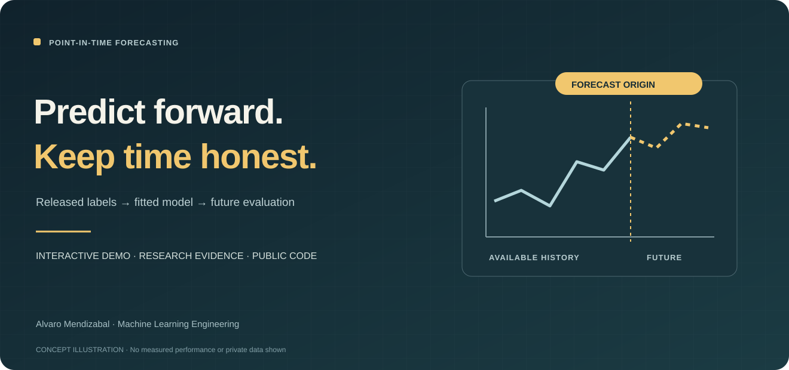

# Commodity Forecasting

**Alvaro Mendizabal · Time-series ML · Point-in-time evaluation · AWS research engineering**

[](https://github.com/alvaromendizabal/commodity-prediction/actions/workflows/quality.yml)
[](https://github.com/alvaromendizabal/commodity-prediction/actions/workflows/portfolio.yml)



I built a forecasting research system across **424 targets and four horizons**, including release-time data contracts, feature/model experiments, chronological evaluation and recoverable AWS execution. Its central finding was consequential: an attractive development improvement did not establish reliable advantage on a stricter historical assessment.

**Start here:** [Forecast Lab demo](https://alvaro-forecasting-lab.tartmacaw2.chatgpt.site) · [Case study](docs/PORTFOLIO_CASE_STUDY.md) · [Three-minute review](docs/REVIEWER_GUIDE.md) · [Run locally](docs/REPRODUCIBILITY.md)

## Try the point-in-time Forecast Lab

[Open the public demo](https://alvaro-forecasting-lab.tartmacaw2.chatgpt.site) without installation. To run the same source locally, open `public-demo/index.html` from a checkout, or serve the checkout:

```bash
python -m http.server 8000
```

Visit `http://localhost:8000/public-demo/`. Change the forecast horizon, label-publication delay and training window. The browser refits a ridge model at each forecast origin using only labels already released, with training-only feature scaling. Compare it with released-label mean and zero baselines, inspect the eligibility ledger and export the run.

The six signal series are authored synthetic data. RMSE, MAE and correlation are computed from the current demonstration; they are distinct from the historical research metric. No market feed, model download, account or private forecasting recipe is used.

```bash
node tools/test_public_demo.mjs
```

## Results and decisions

Historical scores below are mean daily cross-sectional rank correlation divided by its population standard deviation, without annualization. Compare models within each row; the dates differ between rows.

| Evaluation | Matched results | Decision |
|---|---|---|
| Market-path development, 535 dates | **0.309709** | Development result; distinct from later chronological and locked assessments |
| Chronological replication, 355 dates | Candidate **0.289365** vs incumbent **0.276025** | Not promoted: paired 95% interval **[−0.009061, +0.035750]** crosses zero |
| Locked assessment, 247 dates | Incumbent **0.190453** vs training-only mean **0.212085** | No demonstrated advantage; preserved without reselection |
| Delayed-label replay, 134 dates | Training-only selection; separate 73-day terminal segment | Recorded regime shift; no final-period retuning |

## Engineering decisions worth reviewing

- **Release-time correctness.** Horizon-aware label availability, chronological preprocessing and explicit future-access rejection.
- **Zero-fit debugging.** A reconciliation found exact prediction parity for all **37 shared targets**; target composition explained an apparent regression.
- **Controlled research.** A ledger of **20 families**, including tree ensembles, sequence models, Transformers, graph features, covariance methods and online adaptation.
- **Recoverable execution.** Atomic checkpoints, source/config hashes, process-conflict guards and success/failure returns preserved completed work.

[Technical case study](docs/PORTFOLIO_CASE_STUDY.md) · [Executed closeout notebook](notebooks/28_final_research_closeout.ipynb) · [Research ledger](reports/final_research_ledger.json)

## Run the Python evidence checks

Python 3.12; no dependencies or cloud account needed for these commands:

```bash
python3 scripts/verify_portfolio.py
python3 examples/delayed_label_demo.py
```

For the locked environment and full public source checks:

```bash
uv sync --frozen --extra dev
uv run --frozen --extra dev python scripts/quality.py
```

[Reproducibility](docs/REPRODUCIBILITY.md) documents the notebook and test scope.

## Completed scope

The research cycle is complete and frozen. The public demo adds an executable way to inspect information timing; it does not revise the historical forecasting findings or establish trading profitability.

Public code, aggregate evidence, notebooks and synthetic examples are retained. This is not a release of the latest private forecasting implementation. Restricted data, private prediction matrices, fitted weights, credentials and complete private orchestration remain excluded. [Closeout](docs/FINAL_RESEARCH_CLOSEOUT.md) · [Publication scope and source credits](docs/PUBLICATION_SCOPE.md)
