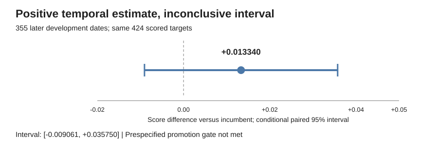

# Commodity forecasting: an engineering and research case study

**Project by Alvaro Mendizabal** · [GitHub](https://github.com/alvaromendizabal)

## The problem

The task was to rank short-horizon returns across 424 commodity-related targets spanning four forecast horizons. It is a noisy forecasting problem in which an apparently strong feature or model can improve one historical period and fail to transfer to another. The objective aggregates daily cross-sectional rank correlations, rewarding both their average and their consistency. Lower pointwise error alone does not establish improvement on that objective.

This was a research and evaluation project, not a live trading service. The public case study focuses on engineering decisions and recorded evidence; the latest implementation and detailed training recipe are intentionally withheld.

## Ownership and scope

The project spans problem framing, data-contract design, prediction-time feature construction, validation, model experiments, result reconciliation, checkpointed AWS execution, and analytical communication. The employer-facing contribution is that integrated workflow and the decisions supported by it, not a claim that the final system beat a competition winner.

The latest research ran in an AWS workspace. GitHub serves as a curated evidence layer rather than a mirror of that workspace. Full experiment notebooks, detailed configurations, private matrices, fitted checkpoints, and operational logs are not added by this release. Earlier material already published in the repository remains archival and publicly visible.

## System design

The workflow separates five responsibilities:

**Data contracts and information timing.** Input and target identifiers, ordering, numeric validity, and label availability are checked before model fitting. Historical labels are usable only after their forecast-horizon-specific release delay. Chronological validation and an exclusion buffer prevent training outcomes from crossing the assessment boundary.

**Representation and modeling.** The established system combines market information, risk-state representations, and released target history in a pooled nonlinear model. A distinct target-routed, top-solution-inspired stack was tested as a candidate. These are selectively adapted mechanisms; complete recreation of every leading solution is not claimed.

**Experiment control.** Candidate definitions are frozen before evaluation. Comparisons align the same target columns and date IDs. Exploratory screening, retrospective temporal replication, and the final historical assessment are treated as different evidentiary stages.

**Artifact integrity and recovery.** Intermediate stages save predictions and completion receipts. Checksums and source/configuration identities make reuse explicit. A failed later step need not trigger another model fit. Development-prediction replay is a gate before final assessment, not a substitute for that assessment.

**Analytical presentation.** Private executed notebooks retain the detailed evidence. This public presentation exposes the question, comparisons, uncertainty, and decision, while withholding the model-building implementation.

## The most informative debugging result

An original mixed-horizon panel improved the first screening period from 0.403381 to 0.418181. A later expansion to 106 one-day targets instead scored 0.385559. Treating the second study as simply a larger version of the first would have been misleading: their target composition differed.

A saved-prediction reconciliation required zero new model fits. Predictions on all 37 shared one-day targets matched exactly. Removing the original panel's 27 longer-horizon replacements reduced the score to 0.397522; adding the other 69 one-day replacements reduced it again to 0.385559.

That result separated numerical reproducibility from research design. The shared-target implementation was not responsible for the change; the experiment had changed which targets received the candidate predictions. Because the metric is nonlinear, this sequence is order-dependent accounting, not causal feature attribution. It also does not justify selecting the favorable-looking subset after seeing its outcomes.

## Temporal replication

The original panel was therefore frozen and evaluated on two later development periods, keeping all 424 scored targets and the prior candidate definition intact.

| Population | Incumbent | Candidate | Difference |
|---|---:|---:|---:|
| 180 dates, IDs 1349-1528 | 0.167042 | 0.177350 | +0.010308 |
| 175 dates, IDs 1529-1703 | 0.390619 | 0.411945 | +0.021326 |
| Pooled 355 later dates | 0.276025 | 0.289365 | +0.013340 |

Both period differences were positive, but the pooled conditional paired 95% interval was [-0.009061, +0.035750]. The prespecified gate required a positive lower endpoint as well as improvement in both periods. The candidate was not promoted. This is an inconclusive positive estimate, not proof that the candidate has no predictive value.

These periods had been used in earlier project research. The result is retrospective temporal replication, not an untouched final test. The established 535-date development reference of 0.309709 uses a different population and is not directly comparable to the pooled number above.

## Locked historical assessment

The retained incumbent was reconstructed before final access. Its saved development predictions were replayed exactly across 175 dates and 424 targets. A final fitted model and assessment contract were then locked. The comparison covered all 247 requested historical dates, IDs 1714-1960, with 424 targets and no dates excluded from the primary score.

| Prespecified system | Score |
|---|---:|
| Frozen incumbent | 0.190453 |
| Training-only historical mean | 0.212085 |
| Difference | -0.021632 |

The conditional paired 95% interval for the difference was [-0.133651, +0.080336]. There was no demonstrated advantage over the simple control. The final result was recorded without replacing the selected model or tuning against those outcomes. No final-period model refitting, live deployment, profitability, official leaderboard placement, or win is claimed.

The repository documented this interval as reserved. Access outside the available execution evidence cannot be independently excluded, so the public description is deliberately a documented historical assessment rather than a categorical claim of never-observed data.

## What the work establishes

The project produced a functioning point-in-time research system, a traceable experiment record, a zero-fit explanation for a misleading expansion, and a completed assessment with an explicit decision. It also exposed an important limitation: greater feature/model complexity did not demonstrate a final advantage over the control.

The feature study is not presented as proof that every useful representation has been exhausted. The candidate stack is not presented as a faithful reconstruction of undisclosed winner settings. Private engineering reproducibility supports the evidence, but this presentation does not distribute the recipe needed to reproduce the latest system.

## Evidence basis

Published numbers are drawn from the owner's returned execution receipts: the 106-target study (20260921T231222Z-500), saved-prediction reconciliation (20260921T234713Z-535), temporal replication (20260922T000824Z-509), and final historical assessment (20260922T005540Z-518). The aggregate summary in this repository identifies these records without distributing private data or training artifacts.

The scientific closeout is complete for this research cycle. Any subsequent modeling would be a separate research program requiring a new evaluation design; it would not turn this already-evaluated historical population back into an untouched test.
