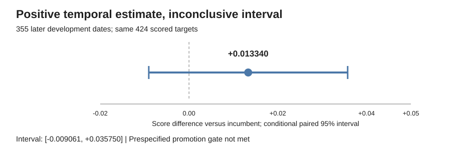
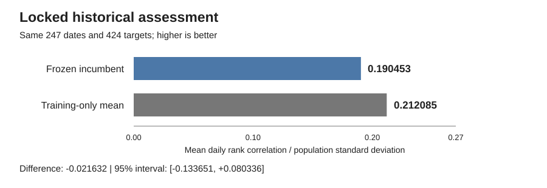

# Commodity forecasting: an engineering and research case study

**Project by Alvaro Mendizabal**  [GitHub](https://github.com/alvaromendizabal)

**Recorded outcome:** a positive later-development estimate failed the uncertainty gate; the locked historical assessment did not demonstrate an advantage over a training-only mean. The contribution is a tested research workflow and a transparent evaluation record. [Five-minute reviewer path](REVIEWER_GUIDE.md) · [Run public checks](REPRODUCIBILITY.md)

## The problem

The task was to rank short-horizon returns across 424 commodity-related targets spanning four forecast horizons. It is a noisy temporal prediction problem in which apparently strong features or models can improve one historical regime and fail to transfer to another. The objective aggregates daily cross-sectional rank correlations, rewarding both average signal and stability over time.

The project became an end-to-end ML research system rather than a single modeling notebook. It covers point-in-time data contracts, delayed-target availability, feature/model experimentation, temporal validation, AWS execution, checkpoint recovery, uncertainty-aware promotion, and analytical communication.

## Ownership and scope

I owned the research loop from problem framing through closeout:

- data-contract and target-timing design;
- feature and representation research;
- model implementation and clean-room reconstruction of documented public ideas;
- chronological validation and matched-population comparison;
- SageMaker execution, checkpointing, failure diagnosis, and resumability;
- uncertainty analysis and promotion gates;
- notebook/report generation and public/private publication boundaries.

GitHub is the curated public evidence layer. The private AWS workspace retains detailed execution artifacts, fitted checkpoints, prediction matrices, and operational logs that are not appropriate to publish wholesale.

## System design

### Point-in-time data contracts

Every substantial experiment begins by checking target identity/order, numeric validity, historical availability, and release timing. Labels are usable only after their horizon-specific delay. Learned preprocessing is fit inside the relevant training partition.

### Model and representation research

The project tested a broad set of materially different families rather than repeating small hyperparameter changes: mixed-horizon tree ensembles, direct RNN/MLP systems, recursive feature forecasting, Transformers, online adaptation, group-wise trees, joint multi-output models, graph representations, market-phase features, rank/covariance systems, lag-specific experts, and cross-target state-space methods.

### Experiment control

Candidates are locked before the evaluation stage they are meant to test. Comparisons use matching date/target populations. Screening, later temporal replication, historical assessment, competition-sized 73-day windows, and post-competition replay are treated as distinct evidence stages.

### Artifact integrity and recovery

Run IDs, hashes, checkpoints, process audits, and return bundles make reuse explicit. Expensive completed work is not silently retrained after a later failure. Implementation failures are separated from scientifically valid negative experiments.

### Analytical presentation

Executed notebooks and Plotly outputs retain the evidence trail. The public release exposes aggregate numbers, decisions, and methodology while withholding private model-building details.

## A zero-fit debugging result that changed the research direction

An original mixed-horizon panel improved the first screening period from 0.403381 to 0.418181. A later expansion to 106 one-day targets instead scored 0.385559. Treating the second study as simply a larger version of the first would have been misleading because the target composition differed.

A saved-prediction reconciliation required zero new model fits. Predictions on all 37 shared one-day targets matched exactly. Removing the original panel's 27 longer-horizon replacements reduced the score to 0.397522; adding the other 69 one-day replacements reduced it again to 0.385559.

That isolated the real issue: the implementation had not silently changed on shared targets; the experiment had changed which targets received candidate predictions. Because the metric is nonlinear, this accounting is order-dependent and does not justify cherry-picking a favorable subset after observing outcomes.

## Temporal replication

The original panel was frozen and evaluated on two later development periods, keeping all 424 scored targets and the prior candidate definition intact.

| Population | Incumbent | Candidate | Difference |
|---|---:|---:|---:|
| 180 dates, IDs 1349-1528 | 0.167042 | 0.177350 | +0.010308 |
| 175 dates, IDs 1529-1703 | 0.390619 | 0.411945 | +0.021326 |
| Pooled 355 later dates | 0.276025 | 0.289365 | +0.013340 |

Both period differences were positive, but the pooled conditional paired 95% interval was [-0.009061, +0.035750]. The predeclared gate required a positive lower endpoint as well as improvement in both periods, so the candidate was not promoted.

These periods had been used in earlier project research. This is retrospective chronological replication, not an untouched final test. The separate 535-date development reference of 0.309709 uses a different population and should not be numerically ranked against the pooled score above.

## Locked historical assessment

Before assessment, the incumbent reconstruction exactly replayed archived development predictions over 175 dates and 424 targets. The final model and assessment contract were then fixed.

The comparison covered all 247 requested dates, IDs 1714-1960, with 424 targets and no dates excluded from the primary score.

| Prespecified system | Score |
|---|---:|
| Frozen incumbent | 0.190453 |
| Training-only historical mean | 0.212085 |
| Difference | -0.021632 |

The conditional paired 95% interval was [-0.133651, +0.080336]. There was no demonstrated advantage over the simple control. The outcome was recorded without replacing the selected model or retuning against those outcomes.

## Later research: breadth without cherry-picking

A second research phase deliberately moved beyond the original architecture. Major studies included:

- 24 feature-token Transformer fits;
- 206 causal online-refit fits;
- 2,544 group-wise LightGBM/Ridge fits;
- attention/residual/autoencoder online ensembles;
- stable-correlation and target-clustering representations;
- regularized covariance/rank ordering;
- joint multi-target CatBoost;
- heterogeneous RF/XGBoost/CatBoost/DNN ensembles;
- market graph and sequential-market-phase representations;
- A/B swap augmentation and ordinal classification;
- online strategy weighting and signed cluster experts;
- recursive and direct-five feature-state LSTMs;
- lag-group-specific experts;
- lag-table state-space transitions and analog retrieval.

Most of these directions were rejected because they failed a later-period or stability gate. That is an important project result rather than wasted work: the experiment record shows how quickly attractive local gains can disappear under regime shift.

## Competition-sized 73-day evaluation

Later research adopted 73-day windows to create a harder short-regime test. A small regularized-covariance correction became the first later-stage component to improve three consecutive 73-day windows with a positive paired interval. More complex adaptive systems then had to beat that promoted anchor consistently rather than merely improve an easier baseline.

The 73-day protocol exposed a repeated pattern: large selection-window gains could coexist with losses on the next regime. This motivated one final validation upgrade instead of more tuning.

## Final post-competition delayed-label replay

The last research milestone reconstructed the official delayed-label information flow over the final 134 test dates. Candidate choice was locked from training history; the replay exposed labels only when the evaluation interface would have released them; terminal-period outcomes were used for scoring only after predictions were fixed.

The replay showed material distribution shift between historical selection windows and the final period. The correct response was not to adapt further to those already-observed outcomes. The project therefore closed with the final replay preserved as evidence rather than turning the final period into another training loop.

This is the most important scientific conclusion in the project: **the evaluation system must be engineered as carefully as the model.**

## Engineering accomplishments

Beyond model fitting, the project built and exercised:

- deterministic AWS/SageMaker run identities;
- hash-verified handoffs;
- self-tests and smoke tests before compute-heavy stages;
- resumable checkpoints and exact reuse of completed stages;
- process-conflict guards that prevented accidental duplicate workloads;
- CPU/GPU routing and resource-aware execution;
- structured logs plus CPU/GPU/RAM/disk/cost telemetry;
- success/failure return bundles;
- executed notebooks with persisted Plotly outputs;
- explicit distinction between implementation failures and negative scientific results.

## What this work establishes

The project demonstrates the ability to build an ML research system that can:

- detect leakage and information-timing errors;
- reconcile apparently contradictory experiments;
- reproduce external ideas without copying code blindly;
- scale controlled experiments in AWS;
- stop weak directions early;
- preserve negative evidence;
- strengthen validation after optimistic results fail to transfer;
- and ultimately reject its own conclusions when a more faithful test disagrees.

That combination of modeling breadth, engineering ownership, and scientific discipline is the core portfolio result.

## Evidence basis and reproducibility

Published historical numbers are drawn from recorded execution receipts including the original 106-target study, saved-prediction reconciliation, temporal replication, and locked historical assessment. Later aggregate research decisions are summarized in `reports/final_research_ledger.json` and `reports/portfolio_summary.json`.

Run `python scripts/verify_portfolio.py` to validate the public closeout artifacts. See [REPRODUCIBILITY.md](REPRODUCIBILITY.md) for the public/private evidence boundary.

The research cycle is complete. New forecasting work would require a newly defined dataset and evaluation contract rather than continued adaptation to this completed record.
